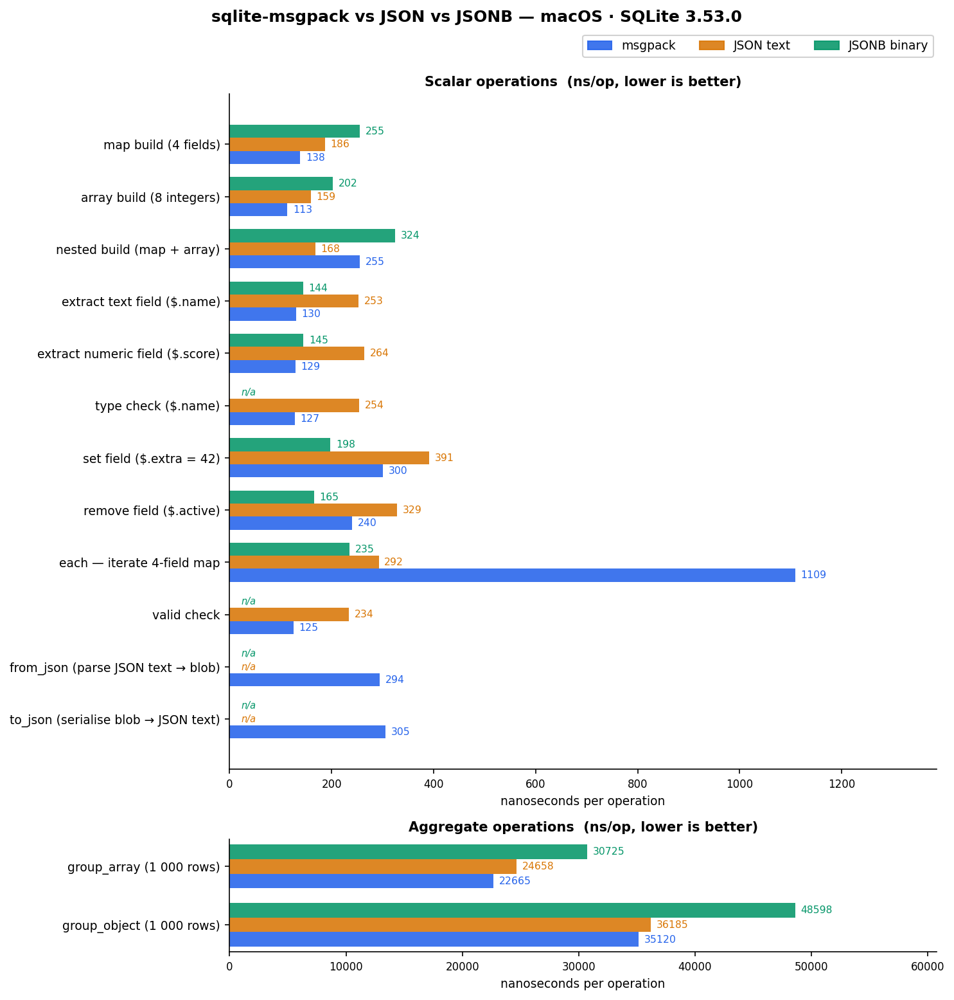
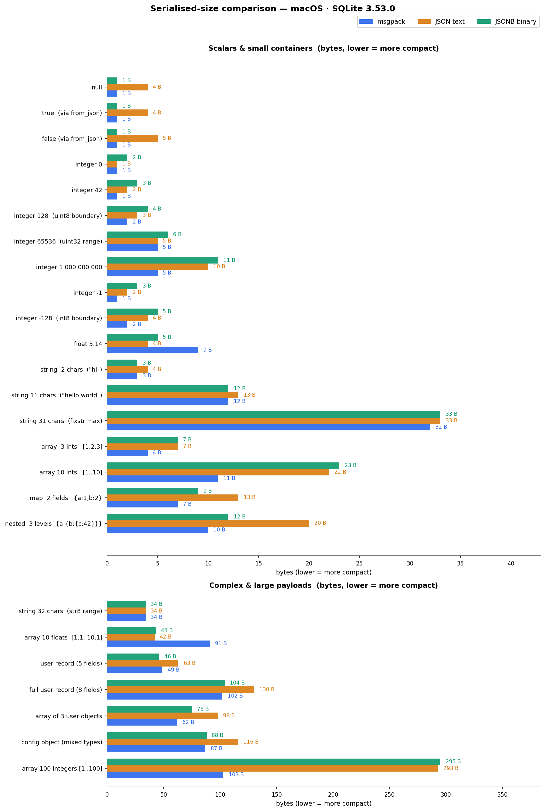

# sqlite-msgpack

[](https://github.com/khanaffan/sqlite-msgpack/actions/workflows/ci.yml)
[](LICENSE)

**sqlite-msgpack** is a SQLite extension that adds functions for creating, querying, and
mutating [MessagePack](https://msgpack.org/) BLOBs directly inside SQL queries. The API is
modeled after SQLite's built-in
[JSON1 extension](https://www.sqlite.org/json1.html) so it is immediately familiar to anyone
who has used `json_extract`, `json_set`, or `json_each`.

MessagePack values are stored as ordinary SQLite `BLOB` columns. All functions are
deterministic and side-effect free (copy-on-write mutation).

A standalone **[C++ Blob API](docs/cpp-api.md)** is also provided for use outside
SQLite — it supports all msgpack primitive types (including fixed-width integers,
float32/64, ext, timestamp, and binary) and produces byte-identical blobs.  Full
[interop tests](tests/test_interop.cpp) verify round-trip compatibility between
the SQL and C++ APIs, and a [fuzz harness](tests/fuzz_msgpack_blob.cpp) exercises
every public entry point with arbitrary byte sequences.

---

## Table of contents

1. [Loading the extension](#loading-the-extension)
2. [Building from source](#building-from-source)
3. [Quick start](#quick-start)
4. [Path syntax](#path-syntax)
5. [Type system](#type-system)
6. [Function reference](#function-reference)
   - [Encoding & validation](#encoding--validation)
   - [Construction](#construction)
   - [Extraction](#extraction)
   - [Mutation](#mutation)
   - [JSON conversion](#json-conversion)
   - [Aggregates](#aggregates)
   - [Table-valued functions](#table-valued-functions)
   - [Typed constructors](#typed-constructors)
   - [Timestamp](#timestamp)
   - [Schema validation](#schema-validation)
7. [BLOB auto-embedding](#blob-auto-embedding)
8. [MessagePack spec compliance](#messagepack-spec-compliance)
9. [Performance benchmarks](#performance-benchmarks)
10. [Serialised-size comparison](#serialised-size-comparison)
11. [C++ Blob API](docs/cpp-api.md)
12. [Testing](#testing)

---

## Loading the extension

```sql
-- SQLite shell
.load ./msgpack

-- Application code (C)
sqlite3_load_extension(db, "./msgpack", NULL, &zErr);
```

Once loaded, all `msgpack_*` functions (including typed constructors, timestamp
helpers, and schema validation) and the two table-valued functions
(`msgpack_each`, `msgpack_tree`) are available in every database connection.

---

## Building from source

Requires **CMake ≥ 3.16** and a C99 compiler (GCC, Clang, or MSVC).

```bash
cmake -B build
cmake --build build
ctest --test-dir build
```

The default build produces:

| Artifact | Description |
|----------|-------------|
| `msgpack.so` / `msgpack.dll` / `msgpack.dylib` | Loadable extension |
| `sqlite3_cli` | SQLite shell with extension-loading enabled |

### Build options

| CMake option | Default | Effect |
|---|---|---|
| `BUILD_SHARED_LIBS` | `ON` | Build the loadable extension |
| `MSGPACK_BUILD_TESTS` | `ON` | Build and register CTest test targets |
| `MSGPACK_BUILD_BENCH` | `OFF` | Build benchmark binaries and graph-generation targets |
| `MSGPACK_BUILD_FUZZ` | `OFF` | Build fuzz-testing targets |

---

## Quick start

```sql
-- Encode a scalar value
SELECT hex(msgpack_quote(42));         -- 2A
SELECT hex(msgpack_quote('hello'));    -- A568656C6C6F
SELECT hex(msgpack_quote(NULL));       -- C0  (nil)

-- Build a map and extract from it
SELECT msgpack_extract(
  msgpack_object('name', 'Alice', 'age', 30),
  '$.name'
);  -- Alice

-- Build an array and query its length
SELECT msgpack_array_length(msgpack_array(10, 20, 30));  -- 3

-- Update a value (returns a new BLOB, original is unchanged)
SELECT msgpack_to_json(
  msgpack_set(msgpack_object('a', 1), '$.b', 2)
);  -- {"a":1,"b":2}

-- Convert to/from JSON
SELECT msgpack_to_json(msgpack_from_json('[1,true,"hi"]'));  -- [1,true,"hi"]

-- Aggregate rows into a msgpack array
CREATE TABLE t(v INTEGER);
INSERT INTO t VALUES (1),(2),(3);
SELECT msgpack_to_json(msgpack_group_array(v)) FROM t;  -- [1,2,3]
```

---

## Path syntax

Path expressions follow the same conventions as SQLite's JSON1:

| Expression | Meaning |
|------------|---------|
| `$` | The root element |
| `$.key` | Value stored under `key` in a map |
| `$[N]` | Element at zero-based index `N` in an array |
| `$.a.b[2].c` | Chained navigation |

A path that does not exist returns `NULL` from scalar functions and is
treated as a missing element in multi-path and mutation operations.

---

## Type system

Each MessagePack element has a type string returned by `msgpack_type()`:

| Type string | MessagePack formats | SQL affinity |
|-------------|---------------------|--------------|
| `null`      | nil (`0xc0`) | NULL |
| `bool`      | false (`0xc2`), true (`0xc3`) | INTEGER (0 or 1) when extracted |
| `integer`   | positive fixint, negative fixint, uint8–uint64, int8–int64 | INTEGER |
| `real`      | float32, float64 | REAL |
| `text`      | fixstr, str8, str16, str32 | TEXT |
| `blob`      | bin8, bin16, bin32 | BLOB |
| `array`     | fixarray, array16, array32 | BLOB |
| `map`       | fixmap, map16, map32 | BLOB |
| `ext`       | fixext1/2/4/8/16, ext8, ext16, ext32 | BLOB |
| `timestamp` | ext type −1 (ts32, ts64, ts96) | BLOB (use `msgpack_timestamp_s/ns` to decode) |

> **Note on SQL booleans.** SQLite has no boolean type; `1=1` evaluates to
> integer `1`. The `bool` type is only produced by `msgpack_from_json` when it
> parses JSON `true` or `false` literals, or by passing a manually crafted
> BLOB containing `0xc2`/`0xc3`. When a bool element is *extracted* with
> `msgpack_extract` it becomes SQL integer `0` or `1`.

---

## Function reference

### Encoding & validation

#### `msgpack_version()`

Returns the extension version string.

```sql
SELECT msgpack_version();  -- '1.2.0'
```

#### `msgpack_quote(value)`

Encodes a single SQL value as a msgpack BLOB using the smallest valid format:

```sql
SELECT hex(msgpack_quote(NULL));   -- C0
SELECT hex(msgpack_quote(0));      -- 00
SELECT hex(msgpack_quote(127));    -- 7F  (positive fixint)
SELECT hex(msgpack_quote(128));    -- CC80  (uint8)
SELECT hex(msgpack_quote(-32));    -- E0  (negative fixint)
SELECT hex(msgpack_quote(-33));    -- D0DF  (int8)
SELECT hex(msgpack_quote(3.14));   -- CB400...  (float64)
SELECT hex(msgpack_quote('hi'));   -- A268 69  (fixstr)
SELECT hex(msgpack_quote(x'DEAD'));-- C402DEAD  (bin8)
```

#### `msgpack_valid(mp)`  
#### `msgpack_valid(mp, path)`

Returns `1` if `mp` is a well-formed msgpack BLOB, `0` otherwise. With a
`path` argument, returns `1` if the element at that path is well-formed.

```sql
SELECT msgpack_valid(msgpack_quote(42));          -- 1
SELECT msgpack_valid(x'FF');                      -- 0  (0xFF is reserved)
SELECT msgpack_valid(msgpack_array(1,2,3), '$[1]'); -- 1
```

#### `msgpack_error_position(mp)`

Returns the byte offset (1-based) of the first encoding error in `mp`, or
`0` if the BLOB is valid. Useful for diagnosing corrupt data.

```sql
SELECT msgpack_error_position(msgpack_quote(42));  -- 0  (valid)
SELECT msgpack_error_position(x'C1');              -- 1  (0xC1 is never-used byte)
```

---

### Construction

#### `msgpack(mp)`

Validates `mp` and returns it unchanged. Raises an error if `mp` is not a
well-formed msgpack BLOB. Passing `NULL` returns `NULL`.

```sql
SELECT hex(msgpack(msgpack_array(1,2)));  -- same bytes
SELECT msgpack('not a blob');             -- error
```

#### `msgpack_array(v1, v2, ...)`

Returns a msgpack array containing the encoded values. Any number of
arguments is accepted (including zero for an empty array). BLOB arguments
that are themselves valid msgpack are embedded directly as nested elements;
raw BLOBs are stored as `bin` type.

```sql
SELECT msgpack_to_json(msgpack_array(1, 'hello', NULL, 3.14));
-- [1,"hello",null,3.14]

SELECT msgpack_to_json(msgpack_array());
-- []

-- Nested array
SELECT msgpack_to_json(
  msgpack_array(msgpack_array(1,2), msgpack_array(3,4))
);
-- [[1,2],[3,4]]
```

#### `msgpack_object(key1, val1, key2, val2, ...)`

Returns a msgpack map. Arguments must appear in key/value pairs; keys must
be TEXT. Duplicate keys are allowed (last writer wins on extraction, matching
JSON1 behaviour). Raises an error if an odd number of arguments is given.

```sql
SELECT msgpack_to_json(msgpack_object('x', 1, 'y', 2));
-- {"x":1,"y":2}

-- Nested map
SELECT msgpack_to_json(
  msgpack_object('user', msgpack_object('name', 'Bob', 'age', 25))
);
-- {"user":{"name":"Bob","age":25}}
```

---

### Extraction

#### `msgpack_extract(mp, path)`  
#### `msgpack_extract(mp, path1, path2, ...)`

Returns the element at `path` as a SQL value. Arrays and maps are returned
as BLOBs. A missing path returns `NULL`.

With two or more path arguments, returns a new msgpack array whose elements
correspond to each path in order. Missing paths produce `nil` elements in
the result array.

```sql
SELECT msgpack_extract(msgpack_object('a',1,'b',2), '$.a');  -- 1
SELECT msgpack_extract(msgpack_array(10,20,30), '$[2]');     -- 30

-- Multi-path → array
SELECT msgpack_to_json(
  msgpack_extract(msgpack_object('a',1,'b',2,'c',3), '$.a','$.c')
);
-- [1,3]
```

#### `msgpack_type(mp)`  
#### `msgpack_type(mp, path)`

Returns the type string of the root element or the element at `path`. See
[Type system](#type-system) for the full list. Returns `NULL` if the path
does not exist.

```sql
SELECT msgpack_type(msgpack_quote(42));                       -- integer
SELECT msgpack_type(msgpack_quote('hi'));                     -- text
SELECT msgpack_type(msgpack_array(1,2), '$[0]');              -- integer
SELECT msgpack_type(msgpack_object('a', msgpack_array(1)));   -- map
```

#### `msgpack_array_length(mp)`  
#### `msgpack_array_length(mp, path)`

Returns the number of elements in the array or map at `mp` (or at `path`
inside `mp`). Returns `NULL` for scalar values.

```sql
SELECT msgpack_array_length(msgpack_array(1,2,3));    -- 3
SELECT msgpack_array_length(msgpack_object('a',1));   -- 1
SELECT msgpack_array_length(msgpack_quote(99));        -- NULL
SELECT msgpack_array_length(
  msgpack_object('arr', msgpack_array(10,20,30)), '$.arr'
);                                                    -- 3
```

---

### Mutation

All mutation functions are **copy-on-write**: they return a new msgpack BLOB
and leave the original unchanged.

Each function accepts multiple `path, value` pairs in a single call,
applied left to right.

#### `msgpack_set(mp, path, val, ...)`

Inserts or replaces the element at each `path`. If the path does not exist,
it is created (if the parent exists). Equivalent to JSON1's `json_set`.

```sql
SELECT msgpack_to_json(msgpack_set(msgpack_object('a',1), '$.b', 2));
-- {"a":1,"b":2}

SELECT msgpack_to_json(msgpack_set(msgpack_object('a',1), '$.a', 99));
-- {"a":99}
```

#### `msgpack_insert(mp, path, val, ...)`

Inserts only — no-op when the path already exists.

```sql
SELECT msgpack_to_json(msgpack_insert(msgpack_object('a',1), '$.a', 99));
-- {"a":1}  (unchanged — 'a' exists)

SELECT msgpack_to_json(msgpack_insert(msgpack_object('a',1), '$.b', 2));
-- {"a":1,"b":2}
```

#### `msgpack_replace(mp, path, val, ...)`

Replaces only — no-op when the path does not exist.

```sql
SELECT msgpack_to_json(msgpack_replace(msgpack_object('a',1), '$.b', 2));
-- {"a":1}  (unchanged — 'b' missing)

SELECT msgpack_to_json(msgpack_replace(msgpack_object('a',1), '$.a', 99));
-- {"a":99}
```

#### `msgpack_remove(mp, path, ...)`

Removes each element at `path`. Missing paths are silently ignored.

```sql
SELECT msgpack_to_json(msgpack_remove(msgpack_object('a',1,'b',2), '$.a'));
-- {"b":2}

SELECT msgpack_to_json(msgpack_remove(msgpack_array(10,20,30), '$[1]'));
-- [10,30]
```

#### `msgpack_array_insert(mp, path, val, ...)`

Inserts `val` *before* the element at the array index specified in `path`.
Use `$[#]` to append to the end of the array.

```sql
SELECT msgpack_to_json(msgpack_array_insert(msgpack_array(1,3), '$[1]', 2));
-- [1,2,3]

SELECT msgpack_to_json(msgpack_array_insert(msgpack_array(1,2), '$[#]', 3));
-- [1,2,3]
```

#### `msgpack_patch(mp, patch)`

Applies an [RFC 7386 merge-patch](https://www.rfc-editor.org/rfc/rfc7386)
to `mp`. `patch` must be a msgpack map. Keys in `patch` whose values are
`nil` remove the corresponding key from `mp`; all other keys are set.

```sql
SELECT msgpack_to_json(
  msgpack_patch(
    msgpack_from_json('{"a":1,"b":2}'),
    msgpack_from_json('{"b":null,"c":3}')
  )
);
-- {"a":1,"c":3}
```

---

### JSON conversion

#### `msgpack_from_json(json_text)`

Parses a JSON text string and returns the equivalent msgpack BLOB.
Supports all JSON value types: `null`, `true`, `false`, numbers, strings,
arrays, and objects.

```sql
SELECT hex(msgpack_from_json('null'));        -- C0
SELECT hex(msgpack_from_json('true'));        -- C3
SELECT hex(msgpack_from_json('false'));       -- C2
SELECT hex(msgpack_from_json('42'));          -- 2A
SELECT hex(msgpack_from_json('"hello"'));     -- A568656C6C6F
SELECT msgpack_to_json(msgpack_from_json('[1,2,3]'));       -- [1,2,3]
SELECT msgpack_to_json(msgpack_from_json('{"a":1}'));       -- {"a":1}
```

#### `msgpack_to_json(mp)`  
#### `msgpack_to_jsonb(mp)` *(alias)*

Serializes a msgpack BLOB to a JSON text string. Type mapping:

| msgpack type | JSON output |
|---|---|
| nil | `null` |
| false | `false` |
| true | `true` |
| integer | number |
| float32 / float64 | number (`null` for NaN/Infinity) |
| text (UTF-8) | `"string"` with JSON escaping |
| bin | lowercase hex string (e.g. `"deadbeef"`) |
| array | `[...]` |
| map | `{...}` |
| ext | `null` |
| timestamp (ext −1) | `null` (use `msgpack_timestamp_s/ns` for numeric access) |

```sql
SELECT msgpack_to_json(msgpack_array(1, 'hi', NULL, true));
-- [1,"hi",null,true]   -- note: SQL TRUE is integer 1, not msgpack true
```

#### `msgpack_pretty(mp)`  
#### `msgpack_pretty(mp, indent)`

Returns a multi-line, indented JSON string. `indent` controls the number of
spaces per level (default `2`). Useful for debugging stored BLOBs.

```sql
SELECT msgpack_pretty(msgpack_from_json('{"a":1,"b":[2,3]}'));
-- {
--   "a": 1,
--   "b": [
--     2,
--     3
--   ]
-- }
```

---

### Aggregates

Both aggregate functions also work as **window functions** with an `OVER`
clause.

#### `msgpack_group_array(value)`

Accumulates values from every row in the group into a single msgpack array.

```sql
CREATE TABLE scores(player TEXT, score INTEGER);
INSERT INTO scores VALUES ('Alice',10),('Bob',20),('Carol',30);

SELECT msgpack_to_json(msgpack_group_array(score)) FROM scores;
-- [10,20,30]

-- As a window function
SELECT player,
       msgpack_to_json(msgpack_group_array(score) OVER ()) AS all_scores
FROM scores;
```

#### `msgpack_group_object(key, value)`

Accumulates key/value pairs into a single msgpack map. Later rows with a
duplicate key overwrite earlier ones.

```sql
SELECT msgpack_to_json(msgpack_group_object(player, score)) FROM scores;
-- {"Alice":10,"Bob":20,"Carol":30}
```

---

### Table-valued functions

Table-valued functions expand a msgpack BLOB into a result set. Both
functions emit **one row per element** and share the same column schema:

| Column | Type | Description |
|--------|------|-------------|
| `key` | TEXT or INTEGER | Map key (text) or array index (integer) |
| `value` | any | The element value as a SQL scalar; arrays/maps as BLOBs |
| `type` | TEXT | Type string (see [Type system](#type-system)) |
| `atom` | any | Scalar value; `NULL` for arrays and maps |
| `id` | INTEGER | Unique node identifier within this traversal |
| `parent` | INTEGER | `id` of the parent node; `NULL` for the root |
| `fullkey` | TEXT | Full path expression to this element (e.g. `$.a[2]`) |
| `path` | TEXT | Path to the *parent* container |

#### `msgpack_each(mp)`  
#### `msgpack_each(mp, path)`

Iterates the **direct children** of the root element (or of the element at
`path`). Does not recurse into nested arrays or maps.

```sql
SELECT key, value, type
FROM msgpack_each(msgpack_object('a', 1, 'b', 'hello', 'c', NULL));
```

| key | value | type |
|-----|-------|------|
| a | 1 | integer |
| b | hello | text |
| c | NULL | null |

```sql
-- Iterate an array
SELECT key, value FROM msgpack_each(msgpack_array(10, 20, 30));
-- 0 | 10
-- 1 | 20
-- 2 | 30

-- Start at a nested path
SELECT key, value
FROM msgpack_each(msgpack_object('arr', msgpack_array(1,2,3)), '$.arr');
-- 0 | 1
-- 1 | 2
-- 2 | 3
```

#### `msgpack_tree(mp)`  
#### `msgpack_tree(mp, path)`

Recursively traverses **all nodes** in the subtree rooted at `mp` (or at
`path`), in depth-first pre-order. Unlike `msgpack_each`, it descends into
nested containers.

```sql
SELECT fullkey, type, atom
FROM msgpack_tree(msgpack_from_json('{"x":[1,2],"y":3}'));
```

| fullkey | type | atom |
|---------|------|------|
| `$` | map | NULL |
| `$.x` | array | NULL |
| `$.x[0]` | integer | 1 |
| `$.x[1]` | integer | 2 |
| `$.y` | integer | 3 |

```sql
-- Count all leaf nodes (non-containers) in a nested structure
SELECT count(*)
FROM msgpack_tree(msgpack_from_json('{"a":{"b":[1,2,3]}}'))
WHERE type NOT IN ('array','map');
-- 3
```

---

### Typed constructors

These functions create msgpack BLOBs with explicit control over the encoded
type and width, bypassing the automatic "smallest encoding" and auto-embed
rules used by `msgpack_quote`.

#### `msgpack_nil()` / `msgpack_true()` / `msgpack_false()`

Return single-byte msgpack BLOBs for the `nil`, `true`, and `false` constants.
Unlike `msgpack_quote(NULL)`, these are explicit MessagePack types.

```sql
SELECT hex(msgpack_nil());    -- C0
SELECT hex(msgpack_true());   -- C3
SELECT hex(msgpack_false());  -- C2
```

#### `msgpack_bool(value)`

Converts an integer to a msgpack boolean: `0` → `false` (`0xC2`),
non-zero → `true` (`0xC3`).

```sql
SELECT hex(msgpack_bool(1));   -- C3  (true)
SELECT hex(msgpack_bool(0));   -- C2  (false)
```

#### `msgpack_float32(value)`

Encodes a number as a 32-bit IEEE 754 float (5 bytes), regardless of whether
a more compact encoding exists.

```sql
SELECT hex(msgpack_float32(3.14));  -- CA4048F5C3
SELECT hex(msgpack_float32(0));     -- CA00000000
```

#### `msgpack_int8(value)` / `msgpack_int16(value)` / `msgpack_int32(value)`

Encode a signed integer in the specified fixed width. Raises an error if the
value is out of range for the requested type.

| Function | Range | msgpack bytes |
|----------|-------|---------------|
| `msgpack_int8` | −128 to 127 | 2 |
| `msgpack_int16` | −32 768 to 32 767 | 3 |
| `msgpack_int32` | −2 147 483 648 to 2 147 483 647 | 5 |

```sql
SELECT hex(msgpack_int8(-1));     -- D0FF
SELECT hex(msgpack_int16(1000));  -- D103E8
SELECT hex(msgpack_int32(100000));-- D2000186A0
```

#### `msgpack_uint8(value)` / `msgpack_uint16(value)` / `msgpack_uint32(value)` / `msgpack_uint64(value)`

Encode an unsigned integer in the specified fixed width. Raises an error if
the value is out of range.

| Function | Range | msgpack bytes |
|----------|-------|---------------|
| `msgpack_uint8` | 0–255 | 2 |
| `msgpack_uint16` | 0–65 535 | 3 |
| `msgpack_uint32` | 0–4 294 967 295 | 5 |
| `msgpack_uint64` | 0–2⁶⁴−1 | 9 |

```sql
SELECT hex(msgpack_uint8(200));    -- CC C8
SELECT hex(msgpack_uint16(1000));  -- CD03E8
SELECT hex(msgpack_uint64(42));    -- CF000000000000002A
```

#### `msgpack_bin(blob)`

Encodes a BLOB as msgpack `bin` type, **bypassing** the auto-embed logic.
Use this when you want to store raw bytes that happen to be valid msgpack
without having them interpreted as a nested element.

```sql
-- msgpack_quote auto-embeds valid msgpack; msgpack_bin does not
SELECT hex(msgpack_bin(x'2A'));         -- C4012A  (bin8, 1 byte)
SELECT hex(msgpack_bin(x'DEADBEEF'));   -- C404DEADBEEF
```

#### `msgpack_ext(type_code, data)`

Creates a msgpack extension type. `type_code` is a signed integer in
\[−128, 127\]. Uses fixext formats when the data length is 1, 2, 4, 8, or 16
bytes.

```sql
SELECT hex(msgpack_ext(1, x'AABB'));    -- D501AABB  (fixext2, type=1)
SELECT hex(msgpack_ext(42, x'0102'));   -- D52A0102
```

---

### Timestamp

MessagePack defines an extension type (type code `−1`) for timestamps.
These functions create and decode timestamp values.

#### `msgpack_timestamp(seconds)`

Creates a timestamp ext from a numeric value. Integer input is treated as
whole seconds; real (float) input splits into seconds and nanoseconds.
Automatically uses the most compact encoding (ts32, ts64, or ts96).

```sql
-- Integer seconds → ts32 (fixext4, 6 bytes)
SELECT hex(msgpack_timestamp(1712345678));  -- D7FF660EA...

-- Real seconds with fractional nanoseconds → ts64 (fixext8, 10 bytes)
SELECT hex(msgpack_timestamp(1712345678.5));
```

#### `msgpack_timestamp_s(mp)`

Extracts the whole-seconds component from a msgpack timestamp BLOB.

```sql
SELECT msgpack_timestamp_s(msgpack_timestamp(1712345678));     -- 1712345678
SELECT msgpack_timestamp_s(msgpack_timestamp(1712345678.5));   -- 1712345678
```

#### `msgpack_timestamp_ns(mp)`

Extracts the nanoseconds component (0–999 999 999) from a msgpack timestamp.

```sql
SELECT msgpack_timestamp_ns(msgpack_timestamp(1712345678));    -- 0
SELECT msgpack_timestamp_ns(msgpack_timestamp(1712345678.5));  -- 500000000
```

---

### Schema validation

#### `msgpack_schema_validate(mp, schema)`

Validates a MessagePack BLOB against a schema definition. Returns `1` if the
data conforms to the schema, `0` otherwise. This function enables data-contract
enforcement directly in SQL — via `CHECK` constraints, triggers, or ad-hoc
queries.

| Parameter | Type | Description |
|-----------|------|-------------|
| `mp` | BLOB | MessagePack value to validate |
| `schema` | TEXT or BLOB | Schema — either a JSON text string or a pre-compiled msgpack BLOB |

**Schema caching.** When `schema` is a constant expression (the common case in
`CHECK` constraints and triggers), the parsed schema is cached automatically via
SQLite's auxiliary data API. Subsequent rows reuse the cached schema, so there
is no per-row JSON parsing overhead.

##### Boolean schemas

The simplest schemas are literal booleans:

```sql
-- true: accept anything
SELECT msgpack_schema_validate(msgpack_quote(42), 'true');   -- 1

-- false: reject everything
SELECT msgpack_schema_validate(msgpack_quote(42), 'false');  -- 0

-- empty object: accept anything (same as true)
SELECT msgpack_schema_validate(msgpack_quote(42), '{}');     -- 1
```

##### Type validation — `type`

The `type` keyword restricts the allowed MessagePack type. Valid type names:

| Type name | Matches |
|-----------|---------|
| `"null"` | nil (`0xc0`) |
| `"bool"` | true (`0xc3`) and false (`0xc2`) |
| `"integer"` | all integer formats (fixint, uint8–64, int8–64) |
| `"real"` | float32 and float64 |
| `"text"` | all string formats (fixstr, str8/16/32) |
| `"blob"` | all binary formats (bin8/16/32) |
| `"array"` | all array formats (fixarray, array16/32) |
| `"map"` | all map formats (fixmap, map16/32) |
| `"any"` | any type (no restriction) |

```sql
-- Single type
SELECT msgpack_schema_validate(msgpack_quote(42), '{"type":"integer"}');    -- 1
SELECT msgpack_schema_validate(msgpack_quote('hi'), '{"type":"integer"}');  -- 0

-- Union type (array of types)
SELECT msgpack_schema_validate(
  msgpack_quote(NULL),
  '{"type":["integer","null"]}'
);  -- 1

-- Boolean matching
SELECT msgpack_schema_validate(
  msgpack_from_json('true'),
  '{"type":"bool"}'
);  -- 1
```

> **Note:** `msgpack_type()` returns `"true"` or `"false"` for boolean values,
> not `"bool"`. The schema type `"bool"` is a convenience that matches both.
> The type `"any"` matches every value type.

##### Constant matching — `const`

The `const` keyword requires the value to be byte-identical to a specific
constant:

```sql
SELECT msgpack_schema_validate(
  msgpack_quote(42),
  '{"const":42}'
);  -- 1

SELECT msgpack_schema_validate(
  msgpack_quote(99),
  '{"const":42}'
);  -- 0
```

##### Enumeration — `enum`

The `enum` keyword lists the allowed values. The data must exactly match one of
them:

```sql
SELECT msgpack_schema_validate(
  msgpack_quote('active'),
  '{"enum":["active","inactive","pending"]}'
);  -- 1

-- Mixed types are allowed
SELECT msgpack_schema_validate(
  msgpack_quote(NULL),
  '{"enum":[1,2,3,"text",null,true,false]}'
);  -- 1
```

##### Numeric constraints — `minimum`, `maximum`, `exclusiveMinimum`, `exclusiveMaximum`

These keywords constrain integer and real values. All comparisons are performed
using double-precision floating-point arithmetic.

| Keyword | Meaning |
|---------|---------|
| `minimum` | value ≥ minimum |
| `maximum` | value ≤ maximum |
| `exclusiveMinimum` | value > exclusiveMinimum |
| `exclusiveMaximum` | value < exclusiveMaximum |

```sql
-- Age must be 0–150
SELECT msgpack_schema_validate(
  msgpack_quote(25),
  '{"type":"integer","minimum":0,"maximum":150}'
);  -- 1

-- Exclusive bounds
SELECT msgpack_schema_validate(
  msgpack_quote(0),
  '{"type":"integer","exclusiveMinimum":0}'
);  -- 0  (must be strictly > 0)

-- Works with real values too
SELECT msgpack_schema_validate(
  msgpack_quote(3.14),
  '{"type":"real","minimum":0.0,"maximum":10.0}'
);  -- 1
```

> Numeric constraints are only evaluated when the data type is `"integer"` or
> `"real"`. They are silently ignored for other types.

##### Text constraints — `minLength`, `maxLength`

These keywords constrain text (string) length measured in **UTF-8 codepoints**
(not bytes).

| Keyword | Meaning |
|---------|---------|
| `minLength` | codepoint count ≥ value |
| `maxLength` | codepoint count ≤ value |

```sql
SELECT msgpack_schema_validate(
  msgpack_quote('hello'),
  '{"type":"text","minLength":1,"maxLength":100}'
);  -- 1

-- Empty string fails minLength:1
SELECT msgpack_schema_validate(
  msgpack_quote(''),
  '{"type":"text","minLength":1}'
);  -- 0

-- Multi-byte UTF-8 characters count as single codepoints
SELECT msgpack_schema_validate(
  msgpack_quote('café'),
  '{"type":"text","maxLength":4}'
);  -- 1  (4 codepoints, not 5 bytes)
```

> Text constraints are only evaluated when the data type is `"text"`.

##### Array constraints — `items`, `minItems`, `maxItems`

| Keyword | Meaning |
|---------|---------|
| `items` | Schema that every element must satisfy, or `false` to disallow all elements |
| `minItems` | array length ≥ value |
| `maxItems` | array length ≤ value |

```sql
-- Array of integers, 1–10 elements
SELECT msgpack_schema_validate(
  msgpack_array(1, 2, 3),
  '{"type":"array","items":{"type":"integer"},"minItems":1,"maxItems":10}'
);  -- 1

-- Items validation catches bad elements
SELECT msgpack_schema_validate(
  msgpack_array(1, 'oops', 3),
  '{"type":"array","items":{"type":"integer"}}'
);  -- 0

-- items:false means the array must be empty
SELECT msgpack_schema_validate(
  msgpack_array(),
  '{"type":"array","items":false}'
);  -- 1

SELECT msgpack_schema_validate(
  msgpack_array(1),
  '{"type":"array","items":false}'
);  -- 0

-- items:true accepts any elements (same as omitting items)
SELECT msgpack_schema_validate(
  msgpack_array(1, 'mixed', NULL),
  '{"type":"array","items":true}'
);  -- 1
```

> Array constraints are only evaluated when the data type is `"array"`.

##### Map constraints — `properties`, `required`, `additionalProperties`

| Keyword | Meaning |
|---------|---------|
| `properties` | Map of `key name → schema` for known properties |
| `required` | Array of key names that must be present |
| `additionalProperties` | `true` (default), `false`, or a schema for unknown keys |

```sql
-- User object with required fields
SELECT msgpack_schema_validate(
  msgpack_object('name', 'Alice', 'age', 30),
  '{
    "type": "map",
    "required": ["name", "age"],
    "properties": {
      "name": {"type": "text", "minLength": 1},
      "age":  {"type": "integer", "minimum": 0}
    },
    "additionalProperties": false
  }'
);  -- 1

-- Missing required key
SELECT msgpack_schema_validate(
  msgpack_object('name', 'Alice'),
  '{"type":"map","required":["name","age"]}'
);  -- 0

-- Additional properties: false rejects unknown keys
SELECT msgpack_schema_validate(
  msgpack_object('name', 'Alice', 'extra', 1),
  '{
    "type": "map",
    "properties": {"name": {"type": "text"}},
    "additionalProperties": false
  }'
);  -- 0

-- Additional properties: schema validates unknown keys
SELECT msgpack_schema_validate(
  msgpack_object('name', 'Alice', 'tag', 'vip'),
  '{
    "type": "map",
    "properties": {"name": {"type": "text"}},
    "additionalProperties": {"type": "text"}
  }'
);  -- 1
```

> Map constraints are only evaluated when the data type is `"map"`.

##### Nested schemas

Schemas compose naturally. The `items` keyword for arrays and the `properties`
keyword for maps both accept full schemas, allowing arbitrarily deep validation:

```sql
-- Array of user objects
SELECT msgpack_schema_validate(
  msgpack_array(
    msgpack_object('name','Alice','age',30),
    msgpack_object('name','Bob','age',25)
  ),
  '{
    "type": "array",
    "items": {
      "type": "map",
      "required": ["name", "age"],
      "properties": {
        "name": {"type": "text"},
        "age":  {"type": "integer", "minimum": 0}
      }
    }
  }'
);  -- 1

-- Deeply nested: map → map → array → integer
SELECT msgpack_schema_validate(
  msgpack_object('outer',
    msgpack_object('inner',
      msgpack_array(1, 2, 3))),
  '{
    "type": "map",
    "properties": {
      "outer": {
        "type": "map",
        "properties": {
          "inner": {
            "type": "array",
            "items": {"type": "integer"}
          }
        }
      }
    }
  }'
);  -- 1
```

Recursion is limited to a depth of 200 levels to prevent stack overflow.

##### Usage patterns

**CHECK constraints on table columns:**

```sql
CREATE TABLE events (
  id    INTEGER PRIMARY KEY,
  data  BLOB NOT NULL
    CHECK (msgpack_schema_validate(data, '{
      "type": "map",
      "required": ["event", "ts"],
      "properties": {
        "event": {"type": "text"},
        "ts":    {"type": "integer", "minimum": 0},
        "meta":  {"type": "map"}
      }
    }'))
);

-- Succeeds
INSERT INTO events(data) VALUES (
  msgpack_object('event', 'click', 'ts', 1712345678)
);

-- Fails CHECK constraint — missing 'ts'
INSERT INTO events(data) VALUES (
  msgpack_object('event', 'click')
);
```

**Stored schemas in a lookup table:**

```sql
CREATE TABLE schemas (
  name   TEXT PRIMARY KEY,
  schema TEXT NOT NULL
);

INSERT INTO schemas VALUES ('user_v1', '{
  "type": "map",
  "required": ["name", "email"],
  "properties": {
    "name":  {"type": "text", "minLength": 1},
    "email": {"type": "text"},
    "age":   {"type": "integer", "minimum": 0, "maximum": 150}
  }
}');

-- Validate on insert via trigger
CREATE TRIGGER validate_users BEFORE INSERT ON users
BEGIN
  SELECT RAISE(ABORT, 'schema validation failed')
  WHERE NOT msgpack_schema_validate(
    NEW.profile,
    (SELECT schema FROM schemas WHERE name = 'user_v1')
  );
END;
```

**Finding invalid rows in existing data:**

```sql
SELECT rowid, msgpack_to_json(data)
FROM events
WHERE NOT msgpack_schema_validate(data, '{
  "type": "map",
  "required": ["event", "ts"]
}');
```

##### Schema keyword reference

| Category | Keyword | Value type | Description |
|----------|---------|------------|-------------|
| General | `type` | text or array | Required type name(s) |
| General | `const` | any | Exact value match |
| General | `enum` | array | List of allowed values |
| Numeric | `minimum` | number | value ≥ minimum |
| Numeric | `maximum` | number | value ≤ maximum |
| Numeric | `exclusiveMinimum` | number | value > exclusiveMinimum |
| Numeric | `exclusiveMaximum` | number | value < exclusiveMaximum |
| Text | `minLength` | integer | UTF-8 codepoint count ≥ value |
| Text | `maxLength` | integer | UTF-8 codepoint count ≤ value |
| Array | `items` | schema or bool | Schema for all elements, or `false` to require empty |
| Array | `minItems` | integer | array length ≥ value |
| Array | `maxItems` | integer | array length ≤ value |
| Map | `properties` | object | Map of key name → sub-schema |
| Map | `required` | array of text | Keys that must exist |
| Map | `additionalProperties` | bool or schema | Constraint for unlisted keys |

---

## BLOB auto-embedding

When a BLOB value is passed to any construction or mutation function, the
extension checks whether it is valid msgpack:

- **Valid msgpack BLOB** → embedded directly as a nested element (transparent nesting)
- **Invalid / raw BLOB** → stored as msgpack `bin` type

This makes composition natural without extra wrapping:

```sql
-- Works just like JSON1's json() wrapper for nested values
SELECT msgpack_to_json(
  msgpack_object(
    'tags',   msgpack_array('sqlite', 'msgpack'),
    'meta',   msgpack_object('version', 1)
  )
);
-- {"tags":["sqlite","msgpack"],"meta":{"version":1}}
```

---

## MessagePack spec compliance

This extension implements the
[MessagePack specification](https://github.com/msgpack/msgpack/blob/master/spec.md)
in full:

- **Smallest encoding rule** — values are always encoded in the most compact
  valid format (e.g., `42` uses positive fixint `0x2a`, not uint8 `0xcc 0x2a`).
  Use the typed constructors (`msgpack_int8`, `msgpack_uint32`, etc.) when you
  need a specific wire width.
- **All 36 format families** — nil, bool, positive fixint, negative fixint,
  uint8/16/32/64, int8/16/32/64, float32/64, fixstr, str8/16/32,
  bin8/16/32, fixarray, array16/32, fixmap, map16/32, fixext1/2/4/8/16,
  ext8/16/32.
- **Extension types** — arbitrary ext types via `msgpack_ext(type_code, data)`.
- **Timestamp extension** — built-in support for the standard timestamp
  extension type (type code −1) with ts32, ts64, and ts96 encodings via
  `msgpack_timestamp()`.
- **Copy-on-write mutation** — no in-place modification; every mutation
  returns a new BLOB.
- **Never-used byte** — `0xc1` is treated as an error by `msgpack_valid`
  and `msgpack_error_position`.

---

## License

[MIT](LICENSE) — see the `LICENSE` file for details.

SQLite itself is in the [public domain](https://www.sqlite.org/copyright.html).

---

<!-- BENCH_START -->
## Performance benchmarks

> Nanoseconds per operation — lower is better.  
> `json/mp` and `jsonb/mp`: ratio relative to msgpack (>1 means msgpack is faster).  
> Platform: macOS · SQLite 3.51.3

| Operation                          | msgpack ns/op | json ns/op | jsonb ns/op |  json/mp |  jsonb/mp |
|----------------------------------- |---------------|------------|-------------|----------|-----------|
| map build (4 fields)               |         408.3 |     1168.3 |      1408.8 |    2.86x |     3.45x |
| array build (8 integers)           |         328.9 |      584.9 |       757.7 |    1.78x |     2.30x |
| nested build (map + array)         |         782.8 |      647.6 |      1218.1 |    0.83x |     1.56x |
| extract text field ($.name)        |         573.9 |      944.6 |       649.3 |    1.65x |     1.13x |
| extract numeric field ($.score)    |         577.2 |     1016.6 |       767.3 |    1.76x |     1.33x |
| type check ($.name)                |         549.6 |      914.2 |         n/a |    1.66x |       n/a |
| set field ($.extra = 42)           |         818.7 |     1590.7 |       950.1 |    1.94x |     1.16x |
| remove field ($.active)            |         865.6 |     1218.0 |       719.8 |    1.41x |     0.83x |
| group_array (1 000 rows)           |       88231.7 |   127026.7 |    142550.0 |    1.44x |     1.62x |
| group_object (1 000 rows)          |      130031.7 |   184090.0 |    215260.0 |    1.42x |     1.66x |
| each — iterate 4-field map       |        2986.1 |     1172.6 |      1004.0 |    0.39x |     0.34x |
| valid check                        |         536.4 |      812.3 |         n/a |    1.51x |       n/a |
| from_json (parse JSON text → blob) |        1000.6 |        n/a |         n/a |      n/a |       n/a |
| to_json (serialise blob → JSON text) |        1588.2 |        n/a |         n/a |      n/a |       n/a |




<!-- BENCH_END -->


---

<!-- SIZE_START -->
## Serialised-size comparison

Byte sizes for identical logical data encoded as msgpack, JSON (text),
and SQLite JSONB (binary).  `mp/json %` and `mp/jsonb %` show msgpack
size as a percentage of the other format — below 100 % means msgpack
is more compact.

> Platform: macOS · SQLite 3.51.3

| Payload                                |  msgpack (B) |   json (B) |   jsonb (B) |  mp/json % |  mp/jsonb % |
|--------------------------------------- |--------------|------------|-------------|------------|-------------|
| null                                   |            1 |          4 |           1 |        25% |        100% |
| true  (via from_json)                  |            1 |          4 |           1 |        25% |        100% |
| false (via from_json)                  |            1 |          5 |           1 |        20% |        100% |
| integer 0                              |            1 |          1 |           2 |       100% |         50% |
| integer 42                             |            1 |          2 |           3 |        50% |         33% |
| integer 128  (uint8 boundary)          |            2 |          3 |           4 |        67% |         50% |
| integer 65536  (uint32 range)          |            5 |          5 |           6 |       100% |         83% |
| integer 1 000 000 000                  |            5 |         10 |          11 |        50% |         45% |
| integer -1                             |            1 |          2 |           3 |        50% |         33% |
| integer -128  (int8 boundary)          |            2 |          4 |           5 |        50% |         40% |
| float 3.14                             |            9 |          4 |           5 |       225% |        180% |
| string  2 chars  ("hi")                |            3 |          4 |           3 |        75% |        100% |
| string 11 chars  ("hello world")       |           12 |         13 |          12 |        92% |        100% |
| string 31 chars  (fixstr max)          |           32 |         33 |          33 |        97% |         97% |
| string 32 chars  (str8 range)          |           34 |         34 |          34 |       100% |        100% |
| array  3 ints   [1,2,3]                |            4 |          7 |           7 |        57% |         57% |
| array 10 ints   [1..10]                |           11 |         22 |          23 |        50% |         48% |
| array 10 floats  [1.1..10.1]           |           91 |         42 |          43 |       217% |        212% |
| map  2 fields   {a:1,b:2}              |            7 |         13 |           9 |        54% |         78% |
| user record (5 fields)                 |           49 |         63 |          46 |        78% |        107% |
| full user record (8 fields)            |          102 |        130 |         104 |        78% |         98% |
| nested  3 levels  {a:{b:{c:42}}}       |           10 |         20 |          12 |        50% |         83% |
| array of 3 user objects                |           62 |         98 |          75 |        63% |         83% |
| config object (mixed types)            |           87 |        116 |          88 |        75% |         99% |
| array 100 integers [1..100]            |          103 |        293 |         295 |        35% |         35% |




<!-- SIZE_END -->

---

## Testing

The project includes a comprehensive test suite covering both the SQL extension and the C++ API.

```bash
cmake -B build -DMSGPACK_BUILD_TESTS=ON
cmake --build build
cd build && ctest --output-on-failure
```

### Test targets

| CTest target | Language | Tests | Description |
|---|---|---|---|
| `msgpack_unit` | C | 12 | Core SQLite extension unit tests |
| `msgpack_sql` | SQL | — | SQL integration tests via CLI |
| `msgpack_spec_p1`–`p10` | C | 10 suites | Per-section msgpack spec compliance |
| `msgpack_blob_unit` | C++ | 289 | Standalone C++ API (no SQLite dependency) |
| `msgpack_interop` | C++ | 197 | C++ ↔ SQLite interoperability |
| `fuzz_corpus` | C | 94+ | Fuzz corpus against SQL extension |
| `fuzz_blob_corpus` | C++ | 94+ | Fuzz corpus against C++ API |

### Fuzz testing

Both the SQL extension and C++ API have dedicated libFuzzer harnesses
(`tests/fuzz_msgpack.c` and `tests/fuzz_msgpack_blob.cpp`).  Without libFuzzer,
the corpus runners (`fuzz_corpus_runner` and `fuzz_blob_corpus_runner`) exercise
the same code paths using 94+ seed files as part of the normal CTest suite.

```bash
# With libFuzzer (Clang required)
cmake -B build-fuzz -DMSGPACK_BUILD_FUZZ=ON \
  -DCMAKE_C_COMPILER=clang -DCMAKE_CXX_COMPILER=clang++
cmake --build build-fuzz
./build-fuzz/fuzz_msgpack tests/fuzz_corpus -max_total_time=300
./build-fuzz/fuzz_msgpack_blob tests/fuzz_corpus -max_total_time=300
```
